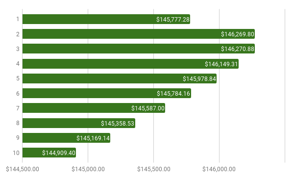
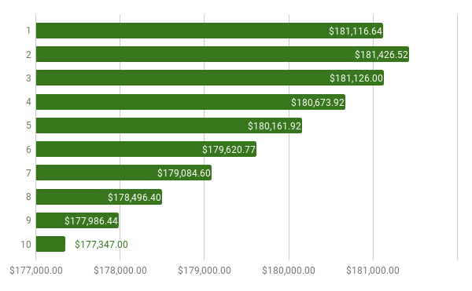
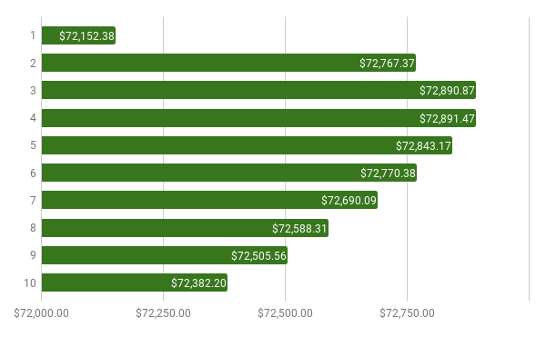
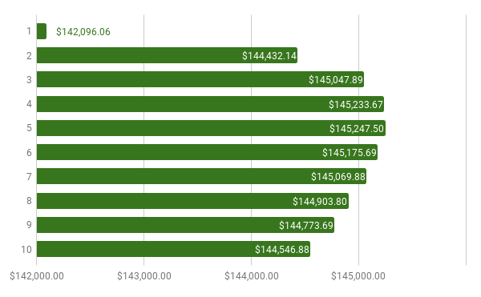
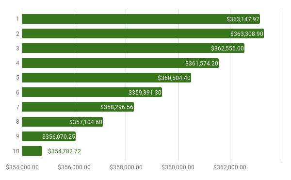

Invest Timer
============

It is often mentioned that, when using ETF's for a couch potato strategy, it is
better to contribute infrequent lump sums instead of small monthly payments,
primarily due to the fees associated with purchases of ETF's. Most brokerages
charge between $5-$35, so if you are only contributing small monthly amounts
the charge is eating away at a large portion of that.

However, on the other hand every month you wait is investment return you are
not receiving. I couldn't find any concrete info on what amounts or with what
regularity we should actually be contributing to ETF's -- is it once per year,
once every five months, once every month? What is most optimal?

This is a short Haskell script that simulates an investment portfolio based on
a given brokerage fee, time range, monthly savings, and average return to 
determine what schedule is the most efficient to buy with. The reality is the
best time is going to be somewhere in the middle of the month most of the time,
but I only wanted to consider the end of each month for practicality reasons.

All of the simulations assume a 10 year estimation window.

I played with a bunch of different configurations and the vast majority of the
time the most optimal window is to invest every 2 - 5 months, depending on the
particular settings. For most situations, choosing to invest every three months
is a relatively safe bet that will either be optimal or relatively close to it.

## Basic Estimate

This assumes a fee of $10, an average return of 4%, and a monthly contribution
of $1,000. You can see that, in this case, the best time to invest is every 
two or three months.

## High Interest Estimate

If you're young you may have a more aggressive portfolio and consider 4% a low
return, but we can increase it to 8% for a different graph. As you'd expect,
this skews the graph toward investing more often -- as your interest goes up
it will be more valuable to invest earlier. For our settings this causes every
second month to be the optimal choice.

## Low Savings Estimate

May $1,000 a month is a bit aggressive and you may not be able to make that 
contribution every single month. Let's take our average way down to a $500/month
contribution and see how that changes the results. Fee's will now take a bigger
cut of the contribution so it will be better to invest every fourth month.

## High Fees Estimate

What if we are using an online brokerage with very high fees? Most are in the
range of $5-$10 but some are as high as $35/trade. At $35 we can see this
drastically affects the optimal month and it now makes the most sense to invest
every five months. It's interesting to note that, even if you invest optimally
in both situations, the higher fees work out to about $1,000 (~0.7%) less value
in the portfolio.

## Shifted Estimate

Let's try changing a bunch of fields and see how that affects the result. This
graph is a $2,000 monthly investment with a $15 fee and an average return of 8%.
This returns every second month as the most optimal.

